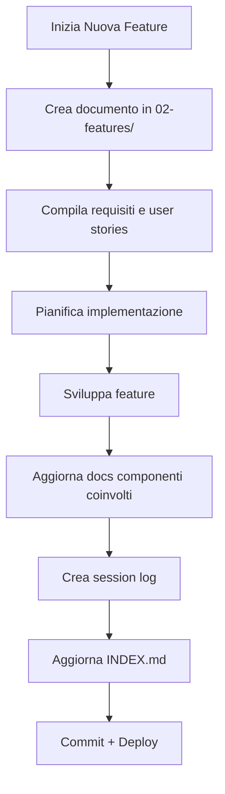
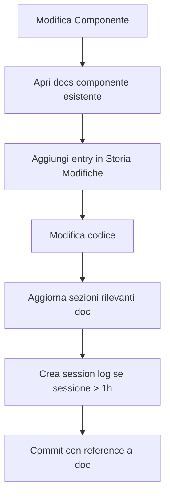

# Sistema di Documentazione MVP Menu

**Data creazione:** 2025-10-25
**Scopo:** Definire una struttura organizzativa per tutta la documentazione del progetto che faciliti il recupero del contesto e la manutenzione nel tempo.

---

## 1. PROBLEMA ATTUALE

### 1.1 Situazione

Attualmente la documentazione è:
- ✅ **Dettagliata:** I documenti esistenti sono molto completi
- ❌ **Disorganizzata:** File sparsi nella root senza gerarchia
- ❌ **Non categorizzata:** Manca una tassonomia chiara
- ❌ **Difficile da navigare:** Nessun indice centrale
- ❌ **Difficile per il context recovery:** Claude deve cercare tra molti file

### 1.2 File Attuali nella Root

```
.
├── README.md                                    # Generic Vite template
├── SETUP_ORDINI_ISTRUZIONI.md                  # Setup ordini
├── PRIORITY_ORDER_SETUP.md                      # Priority order feature
├── SHOPIFY_FOR_RESTAURANTS_ANALYSIS.md         # Analisi Shopify
├── PUBLIC_MENU_STYLES_REFERENCE.md             # Stili menu pubblico
├── THEME_CUSTOMIZER_REFERENCE.md               # ThemeCustomizer (nuovo)
└── [SQL migration files...]                     # Varie migrazioni DB
```

---

## 2. STRUTTURA PROPOSTA

### 2.1 Nuova Organizzazione Directory

```
mvpmenu/
│
├── README.md                          # Overview progetto + link a docs/
│
├── docs/                              # 📁 TUTTA LA DOCUMENTAZIONE
│   │
│   ├── INDEX.md                       # 📋 Indice centrale navigabile
│   │
│   ├── 01-setup/                      # ⚙️ Setup & Configurazione
│   │   ├── getting-started.md
│   │   ├── environment-setup.md
│   │   ├── database-schema.md
│   │   └── deployment.md
│   │
│   ├── 02-features/                   # 🎯 Documentazione Features
│   │   ├── orders-system.md          # Da SETUP_ORDINI_ISTRUZIONI.md
│   │   ├── priority-orders.md        # Da PRIORITY_ORDER_SETUP.md
│   │   ├── rooms-tables.md
│   │   ├── analytics.md
│   │   └── staff-management.md
│   │
│   ├── 03-components/                 # 🧩 Componenti UI
│   │   ├── theme-customizer.md       # Da THEME_CUSTOMIZER_REFERENCE.md
│   │   ├── public-menu.md            # Da PUBLIC_MENU_STYLES_REFERENCE.md
│   │   ├── cart.md
│   │   ├── add-to-cart-modal.md
│   │   ├── product-manager.md
│   │   └── staff-orders.md
│   │
│   ├── 04-architecture/               # 🏗️ Architettura & Design
│   │   ├── design-system.md
│   │   ├── theme-system.md
│   │   ├── state-management.md
│   │   ├── routing.md
│   │   └── api-structure.md
│   │
│   ├── 05-database/                   # 🗄️ Database
│   │   ├── schema.md
│   │   ├── migrations/
│   │   │   ├── 2024-10-23-analytics.sql
│   │   │   ├── 2024-10-24-orders.sql
│   │   │   ├── 2024-10-24-rooms.sql
│   │   │   └── README.md             # Migration log
│   │   └── rls-policies.md
│   │
│   ├── 06-analysis/                   # 📊 Analisi & Research
│   │   ├── shopify-analysis.md       # Da SHOPIFY_FOR_RESTAURANTS_ANALYSIS.md
│   │   ├── competitors.md
│   │   └── user-research.md
│   │
│   ├── 07-api/                        # 🔌 API Documentation
│   │   ├── supabase-functions.md
│   │   ├── endpoints.md
│   │   └── webhooks.md
│   │
│   ├── 08-guides/                     # 📖 Guide Pratiche
│   │   ├── adding-new-component.md
│   │   ├── creating-new-feature.md
│   │   ├── theme-creation-guide.md
│   │   └── troubleshooting.md
│   │
│   ├── 09-session-logs/               # 📝 Log Sessioni Sviluppo
│   │   ├── 2025-10-25-theme-optimization.md
│   │   ├── 2025-10-24-orders-refactor.md
│   │   └── template.md               # Template per nuove sessioni
│   │
│   └── 10-roadmap/                    # 🗺️ Roadmap & Planning
│       ├── current-sprint.md
│       ├── backlog.md
│       └── completed.md
│
├── src/                               # Codice sorgente
├── database/                          # Database exports/backups
├── public/                            # Assets pubblici
└── [altri file progetto...]
```

### 2.2 Vantaggi Struttura

| Vantaggio | Descrizione |
|-----------|-------------|
| **Navigabilità** | Gerarchia chiara a colpo d'occhio |
| **Scalabilità** | Facile aggiungere nuove sezioni |
| **Context Recovery** | Claude trova rapidamente il documento giusto |
| **Separazione concerns** | Setup vs Features vs Components vs Architecture |
| **Versioning** | Session logs tracciano evoluzione progetto |
| **Onboarding** | Nuovo dev trova tutto in docs/INDEX.md |

---

## 3. FILE INDICE CENTRALE

### 3.1 docs/INDEX.md

Proposta contenuto:

```markdown
# 📚 MVP Menu - Indice Documentazione

Benvenuto nella documentazione centrale del progetto MVP Menu.

## 🚀 Quick Start

- [Getting Started](01-setup/getting-started.md) - Prima configurazione
- [Database Schema](01-setup/database-schema.md) - Struttura database
- [Environment Setup](01-setup/environment-setup.md) - Setup .env e variabili

## 🎯 Features Principali

| Feature | Documento | Status | Ultima Modifica |
|---------|-----------|--------|-----------------|
| Sistema Ordini | [orders-system.md](02-features/orders-system.md) | ✅ Completo | 2025-10-24 |
| Priority Orders | [priority-orders.md](02-features/priority-orders.md) | ✅ Completo | 2025-10-24 |
| Sale & Tavoli | [rooms-tables.md](02-features/rooms-tables.md) | ✅ Completo | 2025-10-24 |
| Analytics | [analytics.md](02-features/analytics.md) | ✅ Completo | 2025-10-23 |
| Theme System | [../03-components/theme-customizer.md](03-components/theme-customizer.md) | ✅ Completo | 2025-10-25 |

## 🧩 Componenti UI

| Componente | File | Tematizzato | Note |
|------------|------|-------------|------|
| ThemeCustomizer | [theme-customizer.md](03-components/theme-customizer.md) | N/A | Admin UI |
| PublicMenu | [public-menu.md](03-components/public-menu.md) | ✅ 100% | Completamente themabile |
| Cart | [cart.md](03-components/cart.md) | ⚠️ Parziale | Da completare |
| AddToCartModal | [add-to-cart-modal.md](03-components/add-to-cart-modal.md) | ✅ 100% | Tematizzato |
| ProductManager | [product-manager.md](03-components/product-manager.md) | ❌ No | Non richiesto |

## 🏗️ Architettura

- [Design System](04-architecture/design-system.md) - Tokens, spacing, typography
- [Theme System](04-architecture/theme-system.md) - Come funziona il theming
- [State Management](04-architecture/state-management.md) - Context API, hooks
- [Routing](04-architecture/routing.md) - React Router structure

## 🗄️ Database

- [Schema Completo](05-database/schema.md) - Tutte le tabelle e relazioni
- [Migrations Log](05-database/migrations/README.md) - Storia migrazioni
- [RLS Policies](05-database/rls-policies.md) - Row Level Security

## 📝 Ultime Sessioni Sviluppo

| Data | Titolo | Commit | Documenti Aggiornati |
|------|--------|--------|---------------------|
| 2025-10-25 | Theme Optimization | 4256be8 | theme-customizer.md, public-menu.md |
| 2025-10-24 | Orders System Complete | ... | orders-system.md |

## 🔍 Cerca per Categoria

- **Setup iniziale:** `01-setup/`
- **Feature specifica:** `02-features/`
- **Componente React:** `03-components/`
- **Decisioni architetturali:** `04-architecture/`
- **Database/SQL:** `05-database/`
- **Analisi business:** `06-analysis/`

## 🆘 Troubleshooting

- [Guida Troubleshooting](08-guides/troubleshooting.md)
- [Issues Comuni](08-guides/common-issues.md)

---

**Ultima modifica:** 2025-10-25
**Maintainer:** Team Development
```

---

## 4. TEMPLATE DOCUMENTI

### 4.1 Template per Componente

File: `docs/templates/component-template.md`

```markdown
# [Nome Componente]

**Data creazione:** YYYY-MM-DD
**Ultima modifica:** YYYY-MM-DD
**File:** `src/[path]/[Component].jsx`
**Status:** [In sviluppo / Completo / Deprecated]
**Tematizzabile:** [✅ Sì / ⚠️ Parziale / ❌ No]

---

## 1. PANORAMICA

### 1.1 Scopo

[Breve descrizione funzionalità componente]

### 1.2 Props

| Prop | Type | Required | Default | Descrizione |
|------|------|----------|---------|-------------|
| ... | ... | ... | ... | ... |

---

## 2. STATI & HOOKS

[Descrizione stati locali e hook utilizzati]

---

## 3. LOGICA BUSINESS

[Spiegazione logica principale]

---

## 4. STYLING

[Sistema di styling, theme utilizzato]

---

## 5. INTEGRAZIONE

[Come si integra con altri componenti]

---

## 6. TESTING

- [ ] Unit tests
- [ ] Integration tests
- [ ] Visual regression tests

---

## 7. STORIA MODIFICHE

### YYYY-MM-DD - vX.X

**Commit:** [hash]
**Modifiche:**
- [Change 1]
- [Change 2]

---

## 8. TROUBLESHOOTING

[Problemi comuni e soluzioni]

---

## 9. RIFERIMENTI

- [Link ad altri documenti correlati]
```

### 4.2 Template per Feature

File: `docs/templates/feature-template.md`

```markdown
# [Nome Feature]

**Data creazione:** YYYY-MM-DD
**Ultima modifica:** YYYY-MM-DD
**Status:** [Planning / In sviluppo / Completo / Maintenance]
**Priorità:** [Alta / Media / Bassa]

---

## 1. OBIETTIVO

[Cosa risolve questa feature]

---

## 2. USER STORIES

- Come [tipo utente], voglio [azione] per [beneficio]

---

## 3. REQUISITI FUNZIONALI

- [ ] Requisito 1
- [ ] Requisito 2

---

## 4. ARCHITETTURA

### 4.1 Componenti Coinvolti

| Componente | Ruolo | Modifiche Richieste |
|------------|-------|---------------------|
| ... | ... | ... |

### 4.2 Database

[Tabelle coinvolte, modifiche schema]

### 4.3 API

[Endpoint nuovi o modificati]

---

## 5. IMPLEMENTAZIONE

### 5.1 Piano Step-by-Step

- [ ] Step 1
- [ ] Step 2

### 5.2 Commit History

| Commit | Data | Descrizione |
|--------|------|-------------|
| ... | ... | ... |

---

## 6. TESTING

[Piano di testing]

---

## 7. DEPLOYMENT

[Considerazioni deployment, breaking changes]

---

## 8. METRICHE SUCCESSO

[Come misurare successo feature]

---

## 9. RIFERIMENTI

- [Link documentazione correlata]
```

### 4.3 Template per Session Log

File: `docs/09-session-logs/template.md`

```markdown
# Session Log - [Titolo Breve]

**Data:** YYYY-MM-DD
**Durata:** [ore]
**Developer/AI:** [Nome]
**Obiettivo Sessione:** [Obiettivo principale]

---

## 1. CONTESTO INIZIALE

[Cosa stavi facendo, da dove parti]

---

## 2. OBIETTIVI SESSIONE

- [ ] Obiettivo 1
- [ ] Obiettivo 2
- [ ] Obiettivo 3

---

## 3. ATTIVITÀ SVOLTE

### 3.1 Ricerca/Analisi

[Cosa hai analizzato, file letti, ricerche fatte]

### 3.2 Implementazione

[Codice scritto, file modificati]

### 3.3 Testing

[Test eseguiti, risultati]

---

## 4. DECISIONI TECNICHE

| Decisione | Ragione | Alternative Considerate |
|-----------|---------|-------------------------|
| ... | ... | ... |

---

## 5. PROBLEMI INCONTRATI

| Problema | Soluzione | Tempo Perso |
|----------|-----------|-------------|
| ... | ... | ... |

---

## 6. FILE MODIFICATI

| File | Linee Modificate | Tipo Modifica |
|------|------------------|---------------|
| src/... | 45-78 | Refactoring |
| src/... | new file | Feature add |

---

## 7. COMMIT CREATI

| Hash | Message | Files |
|------|---------|-------|
| abc1234 | Fix: ... | 2 files |
| def5678 | Add: ... | 5 files |

---

## 8. DOCUMENTI AGGIORNATI

- [ ] [docs/03-components/nome.md](../03-components/nome.md)
- [ ] [docs/INDEX.md](../INDEX.md)

---

## 9. TODO NEXT SESSION

- [ ] Task rimanente 1
- [ ] Task rimanente 2

---

## 10. LESSONS LEARNED

[Cosa hai imparato, cosa faresti diversamente]

---

## 11. RIFERIMENTI

- Issue: #123
- PR: #456
- Documenti correlati: [link]
```

---

## 5. WORKFLOW OPERATIVO

### 5.1 Processo per Nuova Feature



### 5.2 Processo per Modifica Componente



### 5.3 Process per Context Recovery (Claude)

Quando Claude riprende una sessione:

1. **Leggi `docs/INDEX.md`** per overview generale
2. **Leggi ultimo session log** in `09-session-logs/`
3. **Leggi documenti specifici** dei componenti/feature in questione
4. **Controlla git log recente** per capire modifiche recenti
5. **Conferma comprensione** con l'utente prima di procedere

---

## 6. NAMING CONVENTIONS

### 6.1 File Markdown

```
kebab-case.md                    # Tutto minuscolo, trattini
feature-name.md                  # Non feature_name.md
theme-customizer.md              # Non ThemeCustomizer.md
```

### 6.2 Session Logs

```
YYYY-MM-DD-brief-description.md  # Data ISO + descrizione breve
2025-10-25-theme-optimization.md
2025-10-24-orders-refactor.md
```

### 6.3 Migration SQL Files

```
YYYY-MM-DD-description.sql       # Data + descrizione
2024-10-24-add-room-id-to-orders.sql
```

---

## 7. METADATI DOCUMENTI

### 7.1 Header Standard

Ogni documento deve avere:

```markdown
# Titolo Documento

**Data creazione:** YYYY-MM-DD
**Ultima modifica:** YYYY-MM-DD
**Status:** [Status]
**[Altri metadati rilevanti]**

---
```

### 7.2 Status Possibili

| Status | Significato |
|--------|-------------|
| ✅ Completo | Documentazione completa e aggiornata |
| 🚧 In Progress | In fase di scrittura |
| ⚠️ Parziale | Incompleto, da espandere |
| 🔄 Da Aggiornare | Obsoleto, necessita revisione |
| 🗑️ Deprecated | Non più rilevante |

---

## 8. TOOL & AUTOMAZIONE

### 8.1 Script Utili (da creare)

```bash
# scripts/docs/new-component.sh
# Crea nuovo documento componente da template

# scripts/docs/new-feature.sh
# Crea nuovo documento feature da template

# scripts/docs/new-session.sh
# Crea nuovo session log con data corrente

# scripts/docs/check-links.sh
# Verifica che tutti i link interni funzionino

# scripts/docs/generate-index.sh
# Rigenera docs/INDEX.md automaticamente
```

### 8.2 Pre-commit Hook

Aggiungere a `.git/hooks/pre-commit`:

```bash
#!/bin/bash
# Check che documenti rilevanti siano aggiornati

echo "Checking documentation..."

# Se modifica src/components/*.jsx
# Verifica che esista docs/03-components/[component].md
# E che sia stato modificato negli ultimi 7 giorni

# Se non aggiornato, warning (non bloccare commit)
```

---

## 9. MIGRATION PLAN

### 9.1 Fase 1: Setup Struttura (1 ora)

- [ ] Creare cartella `docs/` e sottocartelle
- [ ] Creare `docs/INDEX.md` base
- [ ] Creare template in `docs/templates/`
- [ ] Spostare `THEME_CUSTOMIZER_REFERENCE.md` → `docs/03-components/theme-customizer.md`
- [ ] Spostare `PUBLIC_MENU_STYLES_REFERENCE.md` → `docs/03-components/public-menu.md`
- [ ] Aggiornare `README.md` root con link a `docs/INDEX.md`

### 9.2 Fase 2: Migrazione Documenti (2 ore)

- [ ] Spostare `SETUP_ORDINI_ISTRUZIONI.md` → `docs/02-features/orders-system.md`
- [ ] Spostare `PRIORITY_ORDER_SETUP.md` → `docs/02-features/priority-orders.md`
- [ ] Spostare `SHOPIFY_FOR_RESTAURANTS_ANALYSIS.md` → `docs/06-analysis/shopify-analysis.md`
- [ ] Spostare SQL files → `docs/05-database/migrations/`
- [ ] Creare `docs/05-database/migrations/README.md` con log migrazioni

### 9.3 Fase 3: Documenti Mancanti (4 ore)

- [ ] Creare `docs/01-setup/getting-started.md`
- [ ] Creare `docs/01-setup/environment-setup.md`
- [ ] Creare `docs/03-components/cart.md`
- [ ] Creare `docs/03-components/add-to-cart-modal.md`
- [ ] Creare `docs/04-architecture/design-system.md`
- [ ] Creare `docs/04-architecture/theme-system.md`
- [ ] Creare `docs/05-database/schema.md`
- [ ] Creare `docs/08-guides/troubleshooting.md`

### 9.4 Fase 4: Popolamento Session Logs (1 ora)

- [ ] Creare session log per sessione theme optimization (oggi)
- [ ] Creare template session log
- [ ] Documentare workflow session logs

### 9.5 Fase 5: Finalizzazione (1 ora)

- [ ] Popolare completamente `docs/INDEX.md`
- [ ] Verificare tutti i link interni
- [ ] Aggiungere questo documento: `docs/00-meta/documentation-system.md`
- [ ] Commit + aggiornamento README principale

**Tempo totale stimato:** 9 ore

---

## 10. BEST PRACTICES

### 10.1 Scrivere Documentazione

✅ **DO:**
- Usa tabelle per informazioni strutturate
- Includi esempi codice
- Aggiungi sezione "Storia Modifiche"
- Linka documenti correlati
- Usa emoji per status (✅❌⚠️🚧)
- Mantieni TOC (Table of Contents) per doc > 200 righe
- Includi troubleshooting section

❌ **DON'T:**
- Non scrivere "wall of text" senza struttura
- Non lasciare sezioni vuote
- Non usare path assoluti per link interni
- Non dimenticare di aggiornare data modifica
- Non duplicare informazioni tra documenti

### 10.2 Manutenzione Documentazione

**Regola d'oro:** Se modifichi codice, aggiorna documentazione NELLO STESSO COMMIT.

**Checklist pre-commit:**
- [ ] Ho aggiornato il documento componente se ho modificato un componente?
- [ ] Ho aggiornato docs/INDEX.md se ho aggiunto nuove feature?
- [ ] Ho creato session log se la sessione è durata > 1 ora?
- [ ] Ho verificato che i link interni funzionino?

### 10.3 Per Claude (Context Recovery)

**Quando riprendi una sessione:**

1. **Chiedi all'utente:** "Su cosa stavamo lavorando?"
2. **Leggi nell'ordine:**
   - `docs/INDEX.md` (overview)
   - Ultimo file in `docs/09-session-logs/`
   - Documento specifico del componente/feature in questione
3. **Conferma comprensione:** Riassumi cosa hai capito
4. **Procedi:** Solo dopo conferma utente

**Durante la sessione:**
- Aggiorna documenti in real-time
- Traccia decisioni importanti
- Segna TODO per session successiva

**Fine sessione:**
- Crea session log
- Aggiorna documenti modificati
- Lascia note per prossima sessione

---

## 11. METRICHE SUCCESSO

Come sappiamo se questo sistema funziona?

| Metrica | Target | Come Misurare |
|---------|--------|---------------|
| **Context Recovery Time** | < 5 minuti | Tempo per Claude di capire dove eravamo rimasti |
| **Onboarding Time** | < 30 minuti | Tempo per nuovo dev di capire progetto |
| **Doc Freshness** | > 90% | % documenti aggiornati negli ultimi 30 giorni |
| **Link Validity** | 100% | Nessun link interno rotto |
| **Coverage** | > 80% | % componenti/feature documentati |

---

## 12. FAQ

### Q: Devo documentare TUTTO?

**A:** No. Documenta:
- Componenti complessi (> 200 righe)
- Feature business-critical
- Decisioni architetturali
- Integrazioni esterne
- Workaround e hack

Non serve documentare:
- Utility functions semplici
- Componenti < 50 righe
- Codice auto-esplicativo

### Q: Quando creare un session log?

**A:** Crea session log se:
- Sessione > 1 ora
- Lavoro su feature complessa
- Decisioni architetturali importanti
- Multiple modifiche cross-component
- Troubleshooting difficile

### Q: Quanto deve essere dettagliato un documento?

**A:** Sufficiente per permettere a:
1. Te stesso tra 6 mesi di ricordare perché hai fatto così
2. Claude in nuova sessione di riprendere il contesto
3. Nuovo developer di capire senza chiedere

Regola: Se devi spiegare a voce, probabilmente manca nella doc.

### Q: E se la documentazione diventa obsoleta?

**A:**
1. Segna status come `🔄 Da Aggiornare`
2. Crea issue/TODO per aggiornarla
3. Meglio doc obsoleta che nessuna doc (purché segnato)

---

## 13. CONCLUSIONE

### 13.1 Benefici Attesi

| Beneficio | Impatto |
|-----------|---------|
| **Context Recovery** | Claude riprende lavoro in < 5 min invece di 30+ |
| **Onboarding** | Nuovo dev produttivo in ore, non giorni |
| **Manutenzione** | Modifiche più veloci, meno bug |
| **Scalabilità** | Progetto gestibile anche a 50k+ LOC |
| **Knowledge Retention** | Nessuna perdita info tra sessioni |

### 13.2 ROI

**Investimento iniziale:** ~9 ore setup + migrazione
**Risparmio per sessione:** ~20-30 minuti context recovery
**Break-even:** Dopo ~20 sessioni

**Conclusione:** Sistema si ripaga in meno di 1 mese di sviluppo attivo.

### 13.3 Next Steps

1. **Approva questa proposta** ✅
2. **Esegui migration plan** (Fase 1-5)
3. **Usa per 2 settimane** (test pratico)
4. **Raccogli feedback** (cosa funziona, cosa no)
5. **Itera e migliora** (aggiusta in base a uso reale)

---

## 14. RIFERIMENTI

- [Write the Docs - Best Practices](https://www.writethedocs.org/guide/writing/beginners-guide-to-docs/)
- [Documentation Driven Development](https://gist.github.com/zsup/9434452)
- [ADR (Architecture Decision Records)](https://adr.github.io/)

---

**Stato:** 📋 Proposta in approvazione
**Autore:** Claude + Team Development
**Data:** 2025-10-25
**Prossimo Review:** Dopo implementazione Fase 1-2
